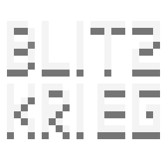

# cc-blitzkrieg
epic crosscode mod
1. Solve and skips puzzles with one button
2. Create selections and save them to a json file
3. Record puzzles (for later automatic solving)
4. Copy selection from map1 to map2 at specified x,y with puzzle variable uniqification, entity offseting, cutscene removal
5. Other collection tools for bossfights and puzzles
6. A lot of utility functions  


|   |   <br> [](https://tokei.rs/b1/github/krypciak/cc-blitzkrieg?type=typescript&label=TypeScript&style=flat&branch=dev) []([https://github.com/krypciak/cc-blitzkrieg](https://tokei.rs/b1/github/krypciak/cc-blitzkrieg?type=JSON&label=Json&style=flat&branch=dev)) <br>   <br> [](https://discord.com/invite/3Xw69VjXfW)  |
|---|---|


### Please report all bugs on the [CrossCode Modding](https://discord.com/invite/3Xw69VjXfW) discord

[](https://github.com/krypciak/cc-blitzkrieg/releases/latest/)

| Dependencies |  |
| --------------------------------------- | --------------------------------------- |
| [cc-blitzkrieg](https://github.com/krypciak/cc-blitzkrieg) | **_[Quick download](https://github.com/krypciak/cc-blitzkrieg/releases/latest)_** |
| [input-api](https://github.com/CCDirectLink/input-api)    | **_[Quick download](https://github.com/CCDirectLink/input-api/releases/latest)_** |  
  
### [cc-vim](https://github.com/krypciak/cc-vim) commands

## Building
```bash
git clone https://github.com/krypciak/cc-blitzkrieg
cd cc-blitzkrieg
npm install
# you can switch to the main branch if you want
# git checkout main
npm run start
# this should return no errors (hopefully)
npx tsc
```
